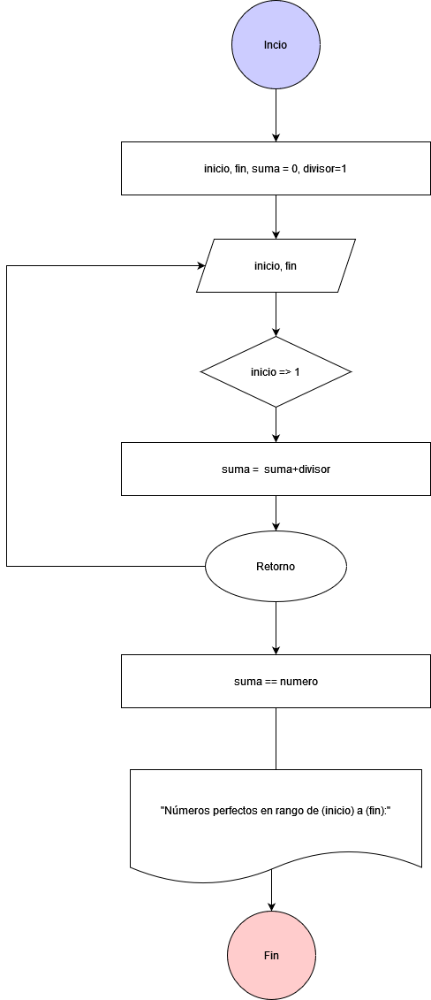

# Ejercicio 1 
___Nabil Léon Álvarez - 1° DAM___

Escribir un programa que encuentre e imprima todos los números perfectos en un rango dado (por ejemplo, entre 1 y 1000).
### Diagrama de Flujo

### Pseudocódigo

Pasos:
- Inicio
- Inicializar variables: __inicio, fin, suma = 0, divisor=1__
- Solicitar la introducción de una un valor inicio y fin
- Si __inicio =>1__ entonces __suma += divisor__ y __suma==numero__
- Repetir proceso hasta hallar todos los números perfectos.
- Escribir "Números perfectos en rango de 1 a 1000:" + suma==numero
- Fin

### Código
       System.out.print("Introduzca el valor de inicio: ");
       int inicio = lecture.nextInt();

       System.out.print("Introduzca el valor de fin: ");
       int fin = lecture.nextInt();

       System.out.println("Números perfectos en rango de " + inicio + " a " + fin + ":");

       for (int numero = inicio; numero <= fin; numero++) {
           int suma = 0;
           for (int divisor = 1; divisor < numero; divisor++) {
               if (numero % divisor == 0) {
                   suma += divisor;
               }
           }
           if (suma == numero) {
               System.out.println(numero);
           }
       }

