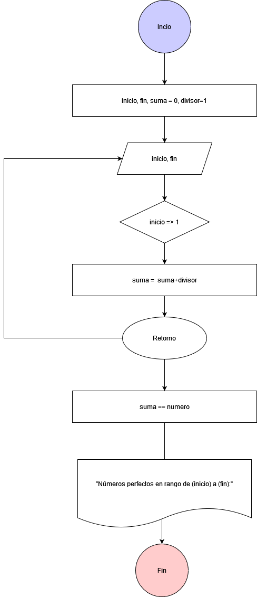

<<<<<<< HEAD
# Ejercicio 1 
___Nabil Léon Álvarez - 1° DAM___

Escribir un programa que encuentre e imprima todos los números perfectos en un rango dado (por ejemplo, entre 1 y 1000).
### Diagrama de Flujo

### Pseudocódigo

Pasos:
- Inicio
- Inicializar variables: __inicio, fin, suma = 0, divisor=1__
- Solicitar la introducción de una un valor inicio y fin
- Si __inicio =>1__ entonces __suma += divisor__ y __suma==numero__
- Repetir proceso hasta hallar todos los números perfectos.
- Escribir "Números perfectos en rango de 1 a 1000:" + suma==numero
- Fin

### Código
       System.out.print("Introduzca el valor de inicio: ");
       int inicio = lecture.nextInt();

       System.out.print("Introduzca el valor de fin: ");
       int fin = lecture.nextInt();

       System.out.println("Números perfectos en rango de " + inicio + " a " + fin + ":");

       for (int numero = inicio; numero <= fin; numero++) {
           int suma = 0;
           for (int divisor = 1; divisor < numero; divisor++) {
               if (numero % divisor == 0) {
                   suma += divisor;
               }
           }
           if (suma == numero) {
               System.out.println(numero);
           }
       }

=======
# Tarea 2

<!-- Recuerda que

## 1. Subtítulo tarea

### 1.1 Subtítulo de la tarea

-- Incluir imagenes

     

-->
# Índice

- Ejercicio 1
- Ejercicio 2
- Ejercicio 3
- Ejercicio 4

## Ejercicio 1 

## Descripción del ejercicio:
Clase que realiza el ejercicio numero 1 de las tareas.

## Diagrama de Flujo:

## Pseudocódigo:
- Inicio.
- Inicializar variables: A, B.
- Solicitar la introducción de dos valores.
- Leer los dos valores.
- Asignarlos a las variables A y B.
- Si A = B Entonces vuelve a 3 porque los valores deben ser distintos.
- Si A>B Entonces Escribir A, “Es el mayor”.
- De lo contrario: Escribir B, “Es el mayor”.
- Fin.

## Ejercicio 2 

## Descripción del ejercicio
Desarrolle un algoritmo que permita leer tres valores y almacenarlos en las variables A, B y C respectivamente.
El algoritmo debe imprimir cual es el mayor y cual es el menor. Recuerde constatar que los tres valores introducidos por
el teclado sean valores distintos. Presente un mensaje de alerta en caso de que se detecte la introducción de valores iguales.

## Diagrama de Flujo

## Pseudocódigo
- Inicio.
- Leer valores.
- Verificar si los tres valores son distintos:
- Si dos o más son iguales → mostramos mensaje → volvemos a pedir valores
- SI son diferentes:
- Si A>B>C → A mayor, i B>C → B segundo, C tercero.
- Si B>A>C → B es mayor, si A>C → A segundo, C tercero.
- Si C>A>B → Si B>A → B segundo, A tercero // Si A>B → A segundo, B tercero.
- Fin.

## Descripción del ejercicio

## Diagrama de flujos

## Pseudocódigo

## Referencias

## Ejercicio 3 

## Descripción del ejercicio
Clase que realiza el ejercicio numero 1 de las tareas.

### Diagrama de Flujo

### Pseudocódigo
- Inicio.
- Inicializar variables: A, B.
- Solicitar la introducción de dos valores.
- Leer los dos valores.
- Asignarlos a las variables A y B.
- Si A = B Entonces vuelve a 3 porque los valores deben ser distintos.
- Si A>B Entonces Escribir A, “Es el mayor”.
- De lo contrario: Escribir B, “Es el mayor”.
- Fin.

## Descripción del ejercicio

## Diagrama de flujos

## Pseudocódigo

## Referencias

>>>>>>> bae9f5eceedd653372dce3be9f31e445425ffea1
