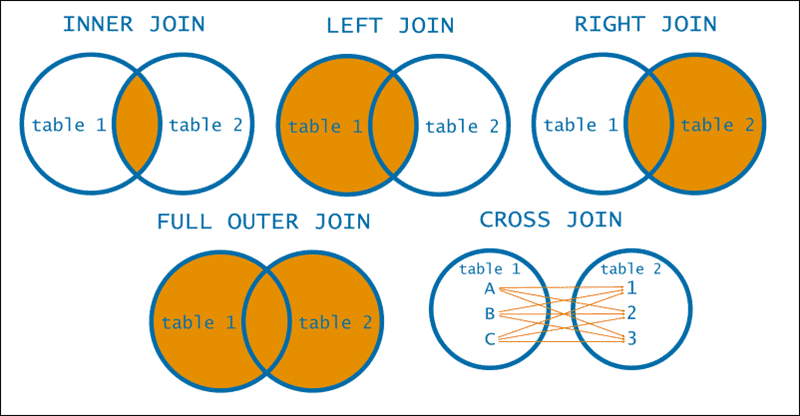

<div align="justify">

## Ejercicio 4 Mundo Join

<div align="center">
    
</div>

En este desafío, tendrán la tarea de crear un algoritmo que simule
el comportamiento de los diferentes tipos de joins de bases de datos: inner, left, right y full.

Implementa un algoritmo que simule el comportamiento de los joins de bases de datos.
Utiliza listas de mapas para representar las tablas de la base de datos. Cada mapa representará una fila de la tabla, donde las claves serán los nombres de las columnas y los valores serán los datos de cada fila.
Implementa métodos separados para cada tipo de join:
- __innerJoin__: Devuelve las filas que coinciden en ambas tablas.
- __leftJoin__: Devuelve todas las filas de la tabla izquierda y las filas coincidentes de la tabla derecha.
- __rightJoin__: Devuelve todas las filas de la tabla derecha y las filas coincidentes de la tabla izquierda.
- __fullJoin__: Devuelve todas las filas de ambas tablas, incluidas las filas que no coinciden en ninguna tabla.

Utiliza las __claves primarias__ y __externas__ para realizar las comparaciones entre las tablas.


>__Nota__: Tablas con las que trabajas en los test

- __Tabla 1__

    | Clave | Valor  |
    |-------|--------|
    | 1     | Juan   |
    | 2     | María  |
    | 3     | Pedro  |

- __Tabla 2__

  | Clave | Valor |
  |-------|-------|
  | 1     | 30    |
  | 3     | 25    |
  | 4     | 35    |

-  Test Inner Join
    >Resultado Esperado
    ```code
    {
    1=[Juan, 30],
    3=[Pedro, 25]
    }
    ```
-  Test Left Join
   >Resultado Esperado
    ```code
    {
    1=[Juan, 30],
    2=[María, null],
    3=[Pedro, 25]
    }
    ```

-  Test Right Join
   >Resultado Esperado
    ```code
    {
    1=[Juan, 30],
    3=[Pedro, 25],
    4=[null, 35]
    }
    ```
-  Test Full Join
   >Resultado Esperado
    ```code
    {
    1=[Juan, 30],
    2=[María, null],
    3=[Pedro, 25],
    4=[null, 35]
    }
    ```

</div>